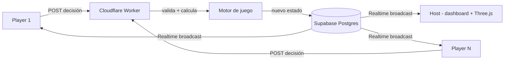

# Energía en Crisis — Documento de Proyecto

Juego web multijugador en tiempo real para una presentación de clase (15 min). 4-6 equipos compiten simultáneamente tomando decisiones de eficiencia energética.

---

## 1. Stack

| Capa | Tecnología | Rol |
|---|---|---|
| Motor de juego + API | Cloudflare Worker (TypeScript) | Única fuente de verdad: valida decisiones, ejecuta la máquina de estados, calcula consecuencias |
| Persistencia + tiempo real | Supabase (Postgres + Realtime) | Guarda el estado de la partida y lo transmite a todos los clientes por un canal broadcast |
| Frontend | Next.js + TypeScript + Tailwind | Vista Host y Vista Player |
| Gráficos 3D | Three.js — **solo en Host** | Modelo de la vivienda; evita cargar WebGL en cada celular conectado |
| Deploy | Vercel (frontend) + Cloudflare (Worker) | — |

**Por qué esta combinación funciona:** el Worker es barato, arranca en milisegundos y no necesitas gestionar servidores. Supabase Realtime te da broadcast sin montar tu propio WebSocket. Todo queda en TypeScript de punta a punta — un solo lenguaje, contratos de tipos compartidos entre Worker y frontend.

---

## 2. Arquitectura



Regla clave: **ningún cliente calcula su propio consumo, costo o eficiencia**. Solo envían la decisión; el Worker responde con el estado ya resuelto.

---

## 3. Contenido y narrativa del juego

### Premisa

> 4-6 equipos compiten para convertir una vivienda/empresa derrochadora en una instalación eficiente, tomando decisiones sobre electricidad y gas antes de que se acabe el tiempo.

Todos los equipos parten del mismo tipo de situación pero toman decisiones distintas; al final se comparan resultados. No gana quien menos consume a secas — gana quien equilibra tres objetivos a la vez: **economía, consumo y eficiencia**.

### Roles

- **Host:** pantalla principal (proyector/TV). Muestra el estado agregado, dispara el evento de crisis, controla el timer.
- **Equipo (3-5 personas):** un dispositivo por equipo, entra a su propia vista con su caso asignado.

### Variables por equipo (estado inicial)

| Variable | Valor inicial | Ícono |
|---|---|---|
| Electricidad | 100 kWh | ⚡ |
| Gas | 100 m³ | 🔥 |
| Presupuesto | $100.000 | 💰 |
| Eficiencia | 50% | 🌱 |
| Tiempo | según fase | ⏱️ |

### Casos de equipo (ejemplo: Familia Duque)

Electrodomésticos: 🧊 Nevera, 📺 Televisor, 🖥️ Computador, ❄️ Aire acondicionado, 🍳 Estufa de gas, 🔥 Calentador de gas, 🧺 Lavadora, 💡 Iluminación.

Problemas ocultos que el equipo debe descubrir en la Ronda 1:
- 💡 4 luces permanecen encendidas innecesariamente.
- 🖥️ El computador permanece encendido 12 horas.
- 🔥 El calentador de gas funciona más tiempo del necesario.
- ❄️ El aire acondicionado está configurado a una temperatura que aumenta el consumo.

Cada equipo recibe un caso distinto (Familia Duque, Empresa X, Apartamento Y…) con su propia combinación de problemas — mismo formato, distinto contenido.

### Ronda 1 — Detectar (2 min)

El equipo hace clic en objetos de su vivienda para investigarlos. Cada clic revela una ficha técnica, por ejemplo:

> **❄️ Aire acondicionado**
> Potencia: 1.500 W · Uso diario: 8 horas · Consumo aproximado: 12 kWh/día

Después de ver la ficha, el equipo decide si ese objeto "es un problema" o no — esto alimenta el resumen educativo final, no afecta el puntaje directamente.

### Ronda 2 — Decidir

Aparecen situaciones con 3 opciones cada una. Ejemplo:

> **🌡️ "Hoy hace mucho calor"**
> A. Aire acondicionado 8h · B. Aire acondicionado 4h · C. Ventilación natural

> **🍳 "Hora de cocinar"**
> A. Estufa de gas 60 min · B. Estufa de gas 30 min · C. Comida que requiere menos cocción

Cada opción tiene un efecto ya definido en `DecisionEffect` (ver sección 5) — el jugador ve el resultado inmediatamente después de elegir.

### Evento sorpresa — Crisis energética (minuto ~9)

> 🚨 **¡Crisis energética!** Debido a una alta demanda, el precio de la electricidad aumentó un 30%.

Dispara una ronda de "últimas decisiones" (Ronda 2b). Las decisiones previas ahora importan: un equipo que ya redujo consumo sufre menos el aumento; uno que dejó todo encendido ve su factura dispararse. El Worker aplica el multiplicador sobre el consumo acumulado de cada equipo, no de forma pareja.

### Ronda 3 — El precio (cálculo final)

El Worker calcula, por equipo: consumo eléctrico total, gas total, costo final, eficiencia final. Ejemplo de salida:

> Equipo 1 — ⚡ 72 kWh · 🔥 45 m³ · 💰 $82.000 · 🌱 78%

### Microcopy educativo (feedback in-game)

Cada decisión debe mostrar el número concreto que ahorró o gastó, para conectar hábito → consumo → costo → impacto. Ejemplos de tono:

> "Dejar el computador encendido 12 horas" → ⚡ 1,8 kWh
> "Apagarlo cuando no se utiliza" → ⚡ 0,6 kWh
> "Tu decisión ahorró 1,2 kWh."

### Resultados finales

Podio con los 3 KPIs por equipo (🥇🥈🥉), seguido de un mensaje de cierre fijo tipo:

> 💡 **¿Qué aprendimos?** El equipo que consiguió el mejor resultado no fue necesariamente el que dejó de consumir, sino el que eliminó los consumos innecesarios manteniendo las necesidades básicas.

### Cronograma sugerido (15 min)

| Tiempo | Actividad |
|---|---|
| 0:00–1:30 | Explicación |
| 1:30–2:00 | Los equipos entran |
| 2:00–4:00 | 🔎 Investigación |
| 4:00–7:00 | ⚡ Decisiones |
| 7:00–9:00 | 🚨 Crisis energética |
| 9:00–11:00 | 🔥 Últimas decisiones |
| 11:00–12:00 | 📊 Resultados |
| 12:00–15:00 | 💡 Reflexión |

### Iconografía (referencia narrativa — para la iconografía real de la interfaz ver `Design.md`, que usa Material Symbols Outlined)

| Ícono | Significado |
|---|---|
| ⚡ | Electricidad |
| 🔥 | Gas |
| 💰 | Presupuesto / costo |
| 🌱 | Eficiencia |
| ⏱️ | Tiempo restante |
| 🏠 | Vivienda / caso del equipo |
| ❄️ | Aire acondicionado |
| 🖥️ | Computador |
| 💡 | Iluminación |
| 🍳 | Cocina / estufa |
| 🚨 | Evento de crisis |
| 🥇🥈🥉 | Podio de resultados |

### Avatares e identidad de equipo

No se necesitan fotos ni assets pesados: cada equipo se identifica con un **color + ícono/emoji + nombre** (ej. 🟦 Equipo Azul, 🟧 Equipo Naranja). Esto es suficiente para distinguir equipos en el ranking del Host y no añade peso ni requiere subir imágenes antes del evento.

### Paleta sugerida (tono "crisis energética")

- Fondo: gris oscuro / casi negro (sensación de "centro de control")
- Acento eléctrico: amarillo/ámbar (⚡)
- Acento gas: naranja/rojo (🔥)
- Acento eficiencia: verde (🌱)
- Acento crisis: rojo de alerta, usado solo durante el evento sorpresa
- Texto: blanco / gris claro sobre fondo oscuro para legibilidad en proyector

---

## 4. Modelo de datos (Supabase)

```sql
-- Una fila por partida
create table games (
  id uuid primary key default gen_random_uuid(),
  phase text not null default 'lobby', -- lobby | investigar | decidir | crisis | decidir_2 | resultados
  timer_ends_at timestamptz,
  crisis_triggered boolean default false
);

-- Una fila por equipo dentro de una partida
create table teams (
  id uuid primary key default gen_random_uuid(),
  game_id uuid references games(id),
  name text not null,
  case_id text not null,       -- referencia al "caso" asignado (Familia Duque, etc.)
  color text not null,         -- identidad visual del equipo
  electricidad numeric default 100,
  gas numeric default 100,
  presupuesto numeric default 100000,
  eficiencia numeric default 50,
  puntos numeric default 0
);

-- Historial de decisiones (para el resumen educativo final)
create table decisions (
  id uuid primary key default gen_random_uuid(),
  team_id uuid references teams(id),
  round text not null,
  choice text not null,
  delta_electricidad numeric,
  delta_gas numeric,
  delta_presupuesto numeric,
  delta_eficiencia numeric,
  created_at timestamptz default now()
);
```

Realtime se activa escuchando cambios en `games` y `teams` (Postgres Changes) o, si prefieres menos overhead de base de datos, usando un canal de **broadcast** puro desde el Worker cada vez que recalcula el estado.

---

## 5. Motor de juego (tipos compartidos)

```typescript
type Phase = 'lobby' | 'investigar' | 'decidir' | 'crisis' | 'decidir_2' | 'resultados';

interface GameState {
  phase: Phase;
  timerEndsAt: string;
  crisisTriggered: boolean;
  teams: TeamState[];
}

interface TeamState {
  id: string;
  name: string;
  color: string;
  electricidad: number;
  gas: number;
  presupuesto: number;
  eficiencia: number;
  puntos: number;
}

interface DecisionEffect {
  electricidad?: number;
  gas?: number;
  presupuesto?: number;
  eficiencia?: number;
}

// Cada decisión posible del juego se define como dato, no como código disperso
interface DecisionOption {
  id: string;
  label: string;
  effect: DecisionEffect;
}
```

Definir las decisiones como **datos** (no como lógica if/else repartida) es lo que permite que balancear el juego después sea editar un JSON, no tocar código.

---

## 6. Vista Host (`/host`)

- Pantalla grande (proyector/TV), un solo cliente por partida.
- Dashboard con ranking en vivo de los 3 KPIs (economía, consumo, eficiencia).
- Timer sincronizado desde `timer_ends_at` (no un `setInterval` local sin ancla).
- Botón para disparar manualmente el evento "Crisis energética" en el minuto indicado.
- Three.js: escena tipo "vecindario" — **una casa low-poly por equipo** (no un modelo agregado genérico), ya que el costo de render solo lo paga el Host, no los celulares de los jugadores.

### Modelo 3D reactivo (diseño)

Cada casa refleja en vivo el `TeamState` de su equipo:

| Variable | Reacción visual |
|---|---|
| Electricidad | Nº de ventanas iluminadas de la casa |
| Gas | Intensidad de partícula de llama/humo en la chimenea |
| Eficiencia | Color del césped/aura: verde → ámbar → rojo |
| Presupuesto | Medidor girando sobre el techo (más rápido = gastando más rápido) |
| Ranking | Halo/spotlight sutil sobre la casa líder |

Durante el evento de Crisis, el ambiente de todo el vecindario cambia a tono rojo-anaranjado con un efecto breve de chispa/parpadeo simultáneo en todas las casas.

Implementación sugerida: `react-three-fiber`, geometría simple por casa (~300-500 triángulos), transiciones con `useFrame` + `lerp` para que los cambios de estado (llegan por Realtime) se vean como transición suave, no salto brusco.

## 7. Vista Player (`/play/[teamId]`)

- Mobile-first, sin WebGL.
- Investigar: tarjetas con íconos (Tailwind + SVG), clic revela datos del electrodoméstico.
- Decidir: opciones tipo botón grande, feedback inmediato ("tu decisión ahorró 1.2 kWh") calculado por el Worker.
- Reconexión: si el celular pierde señal, al reconectar debe pedir el estado actual completo (no confiar solo en eventos incrementales).

---

## 8. Plan de construcción (flujo real: Antigravity + Hermes)

**Fase 0 — Antigravity, cascarón visual únicamente:**
Traduce los mockups aprobados de Stitch (HTML/Tailwind) a componentes Next.js/TypeScript reutilizables, con datos mock y navegación entre las 4 pantallas del Host. Cero lógica de negocio, cero WebSockets, cero Supabase. El bloque del vecindario queda como imagen estática + overlay (sin Three.js todavía). Ver el prompt de Antigravity ya preparado para esta fase.

**Fase 1 — Hermes, un solo agente, sin paralelizar, en paralelo a la Fase 0 (no depende de ella):**
Tipos compartidos (`types/game.ts`, mismos nombres que usa el cascarón de Antigravity) → esquema Supabase → motor de juego puro (testeable sin UI) → endpoint del Worker → un flujo de partida simulada end-to-end.

**Fase 2 — Hermes, una vez Fases 0 y 1 estén listas:**
- Reemplazar los datos mock del cascarón de Antigravity por la suscripción real a Supabase Realtime + llamadas al Worker
- Construir el vecindario reactivo real con `react-three-fiber` (reemplaza la imagen estática de la Fase 0)
- Contenido del juego (casos, eventos, balanceo de números)

Ver `Design.md` para la paleta de colores, tipografía e iconografía exactas (Material Symbols Outlined) que tanto Antigravity como Hermes deben respetar sin alterar.

---

## 9. Riesgos a vigilar

- **Reloj desincronizado:** todos los timers deben derivarse de `timer_ends_at` (timestamp absoluto), nunca de un contador local por cliente.
- **Three.js en el momento equivocado:** si alguien copia el modelo 3D a la vista Player "para que se vea más bonito", ahí se va el rendimiento con 6 conexiones simultáneas desde celulares de gama media.
- **Balanceo de números:** validar los kWh/costos con una hoja de cálculo antes de codificarlos, para no tener que tocar tres capas en paralelo cuando cambien.
